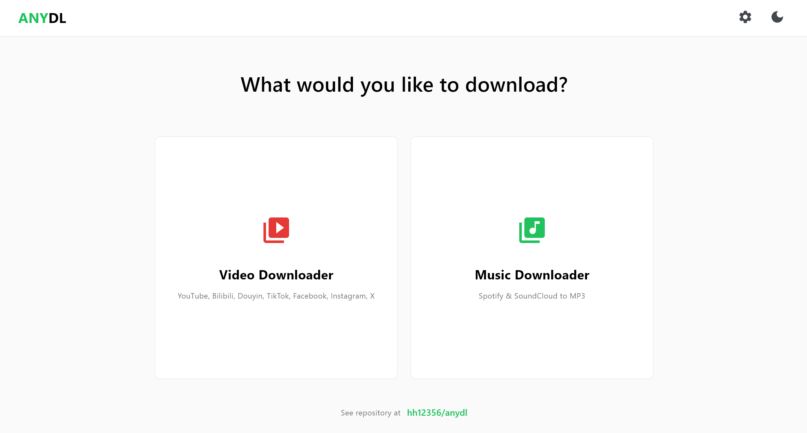

  <h1>anydl</h1>
  
一个统一、干净、现代的桌面音视频下载工具。

  

[English](README.md) · **中文** · [⬇️ 下载 Windows 单文件版](https://github.com/hh12356/anydl/releases/latest)

## 项目简介

**anydl** 是一个用 [Flet](https://flet.dev) 写的开源 Python 桌面应用。它本身不实现下载逻辑，而是提供一个好用的图形界面，去调度几个业界标准的命令行下载引擎。

> 本仓库是 [sytrusz/anydl](https://github.com/sytrusz/anydl) 的 fork，改动见下面的 [与上游版本的改动](#与上游版本的改动)。

---

## 与上游版本的改动

> 完整说明见 [`Changes from upstream.md`](Changes%20from%20upstream.md)。

做了很多优化用户体验的设计。首页从 9 张卡片砍到 2 张，不用挑；而**「贴链接」和「填裁剪时间」这两件每次都要做的事，都改成了自动识别** —— 少一步手动操作，少一次报错：

1. 从网页改成 app
2. **界面更简洁**：更改界面结构，从 9 张卡片改为 2 张
3. **支持更多站点**：下载选项新增了 bilibili 和 douyin
4. **整段粘贴就行**：从 bilibili、抖音复制链接时，并不是单纯的 url，会夹带标题等信息。改动新增了 url 处理，可以直接把复制的完整内容粘贴到输入框，提交时自动识别 url
5. **视频裁剪**：新增 trim 功能，可以自定义下载片段，提取素材更方便
6. **时间不用记格式**：输入裁剪时间时，可以只输入秒数或分钟+秒数，提交时自动解析，大大提高输入体验
7. **日志更干净**：过滤 log 信息，提高其可读性
8. 修复了 ERROR 但弹窗 Success 的 bug

**注意：douyin 视频下载时需先下载 firefox 浏览器并在 firefox 中打开 douyin.com，ANYDL 才能获取 cookie 完成下载。**

---

## 📌 快速开始（安装与运行）

### 方式一：下载单文件版（推荐，仅 Windows）

**[⬇️ 下载 anydl.exe](https://github.com/hh12356/anydl/releases/latest)**（约 159 MB）

双击就能用，**不需要装 Python，也不需要装 FFmpeg**，装好之后断网也能跑。

- **第一次打开要等约 30 秒**（正在解压），之后每次都是秒开。
- 解压位置：依次找 D~H 盘，用第一个存在的盘里的 `anydl` 文件夹；机器上只有 C 盘的话就解压到 exe 旁边。
- 首次运行 Windows 会弹「Windows 已保护你的电脑」，点 **更多信息 → 仍要运行** —— exe 没有代码签名，这是正常现象。
- 卸载 = 删掉解压出来的 `anydl` 文件夹。不写注册表、不加卸载项。

> 想下抖音的话仍然要先装 Firefox 并在里面打开一次 douyin.com，见上方改动说明末尾的注意。

### 方式二：从源码运行（Windows / macOS / Linux）

#### 1. 前置要求

**🪟 Windows 用户：**
什么都不用装。如果系统里没有 Python 和 FFmpeg，`start_windows.bat` 会自动帮你下载便携版（Python 3.11 + FFmpeg），只会下载一次。

**🍎 macOS / 🐧 Linux 用户：**
运行前需要自己装好两样东西：

- **Python 3.8 或更新版本**：多数 Linux 发行版自带。Mac 用户[点这里下载](https://www.python.org/downloads/)。
- **FFmpeg**：音视频转换和裁剪都靠它。
  - **macOS**：`brew install ffmpeg`
  - **Linux**：用包管理器安装，例如 `sudo apt install ffmpeg` 或 `sudo dnf install ffmpeg`

**🔥 想下抖音的话：** 额外装一个 [Firefox](https://www.mozilla.org/firefox/new/)，并**在 Firefox 里打开一次 douyin.com**（不用登录）。原因见上方改动说明末尾的注意。

#### 2. 下载并运行

1. **下载仓库：**
   点右上角绿色的 **"Code"** 按钮，选 **"Download ZIP"**，解压。*（或者用命令行克隆：`git clone https://github.com/hh12356/anydl.git`）*

2. **启动应用：**
   打开解压出来的文件夹，运行对应系统的启动脚本：
   - 🪟 **Windows：** 双击 `start_windows.bat`
   - 🍎 **macOS / 🐧 Linux：** 在终端里执行 `./start_linux.sh`

*脚本会自动把环境配好，然后直接弹出应用窗口。*

---

## 使用方法

1. **选一个入口：** 首页只有两张卡片 —— **Video Downloader**（视频）和 **Music Downloader**（音乐），点进去就行。
2. **粘贴链接：** 视频窗口支持 YouTube、Bilibili、抖音、TikTok、Facebook、Instagram、X；音乐窗口支持 Spotify 和 SoundCloud。**不用说明这是哪个站的链接**，识别是自动的。
3. **（可选）调参数：** 视频窗口里可以选输出 MP4 还是 MP3、填裁剪时间段、勾选"播放列表单独建文件夹"。
4. **点 Download 开跑。**

文件会保存到 `~/Downloads/ANYDL`（Windows 上是 `C:\Users\你的用户名\Downloads\ANYDL`），目录不存在会自动创建。

---

## 功能特性

- 🎥 **视频下载**：YouTube、Bilibili、抖音、TikTok、Facebook、Instagram、X，自动合并为 MP4
- 🎵 **音乐下载**：Spotify 与 SoundCloud 的高质量 MP3，带完整元数据
- ✂️ **片段裁剪**：只下你要的那一段，时间格式怎么写都行（见改动说明第 (5)(6) 条）
- 🚀 **绕过 Spotify 限流**：在 Settings 里填自己的 Spotify Developer API Key，避开公共 API 的限流
- 📁 **播放列表自动分文件夹**：按 `anydl@sytrus - [播放列表名]` 归类
- 📊 **进度与统计**：实时进度条，完成后汇总成功／失败数量
- 🎨 **现代界面**：简洁的卡片式首页，支持深色／浅色主题切换

---

## Powered By

本项目的下载能力全部来自以下开源项目：

- [**yt-dlp**](https://github.com/yt-dlp/yt-dlp)：YouTube、TikTok、Facebook、X (Twitter)、Instagram、Bilibili、抖音等站点的下载引擎
- [**spotDL**](https://github.com/spotDL/spotify-downloader)：Spotify 单曲与播放列表的下载引擎
- [**scdl**](https://github.com/flyingrub/scdl)：SoundCloud 音频的下载引擎

---

## 致谢

感谢开源社区：

- [**Flet**](https://flet.dev/)：UI 框架
- [**yt-dlp**](https://github.com/yt-dlp/yt-dlp)：视频引擎
- [**spotDL**](https://github.com/spotDL/spotify-downloader)：Spotify 引擎
- [**scdl**](https://github.com/flyingrub/scdl)：SoundCloud 引擎

## 许可证

本项目开源，欢迎 fork、修改和分发。
